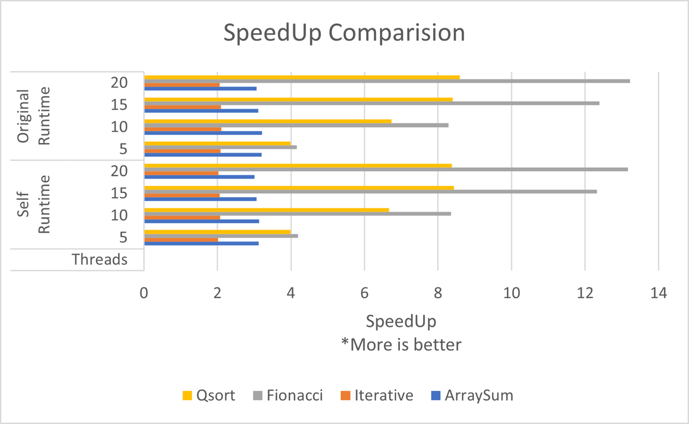

## Runtime Performance Statistics


This repository showcases the performance statistics of a custom runtime developed for a course. The runtime aims to improve the execution speed of specific tasks compared to a baseline system. Here's a breakdown of the performance analysis in four parts:

### Deadline -2
**Part 1: Aim**

* **Goal:** For this part, you have to optimize your implementation of HCArgoLib by supporting a highperformance feature by using  Lazy binary-splitting: a runtime adaptive work-stealing scheduler and An adaptive cut-off algorithm for task parallelism.


**Part 2: Results**

* **Speedup Graphs:** 
    
* **Textual Statistics:** 

| Threads | ArraySum | Iterative | Fibonacci | Qsort             |
|---------|----------|-----------|-----------|-------------------|
|         | Self     | Self      | Self      | Self Runtime      |
| 5       | 3.124062 | 2.020255  | 4.196325  | 3.990969          |
| 10      | 3.129686 | 2.075935  | 8.348425  | 6.668963          |
| 15      | 3.062245 | 2.057317  | 12.32328  | 8.436346          |
| 20      | 3.007087 | 2.023881  | 13.16611  | 8.373343          |
|         | Original | Original  | Original  | Original Runtime  |
| 5       | 3.199527 | 2.080596  | 4.162871  | 3.991978          |
| 10      | 3.212687 | 2.104912  | 8.285777  | 6.73907           |
| 15      | 3.109685 | 2.098238  | 12.38956  | 8.40234           |
| 20      | 3.069016 | 2.060642  | 13.22206  | 8.587806          |


**Part 3: Additional Information**

*  **HCLib Runtime Usage**

1. Clone the repository:
    ```bash
    git clone <repository_url>
    ```

2. Navigate to the cloned directory:
    ```bash
    cd <repository_name>
    ```

3. Run the installation script to compile and install the HCLIB runtime:
    ```bash
    ./install.sh
    ```

4. Set the number of workers (optional):
    ```bash
    export HCLIB_WORKERS=<number_of_workers>
    ```
5. Enable/disable features using compile-time flags:
    ```bash
    # Enable ATC mode
    export ENABLEATC=1

    # Enable LBS mode
    export ENABLELBS=1
    ```

6. Compile and run your application:
    ```bash
    ./<your_application>
    ```

