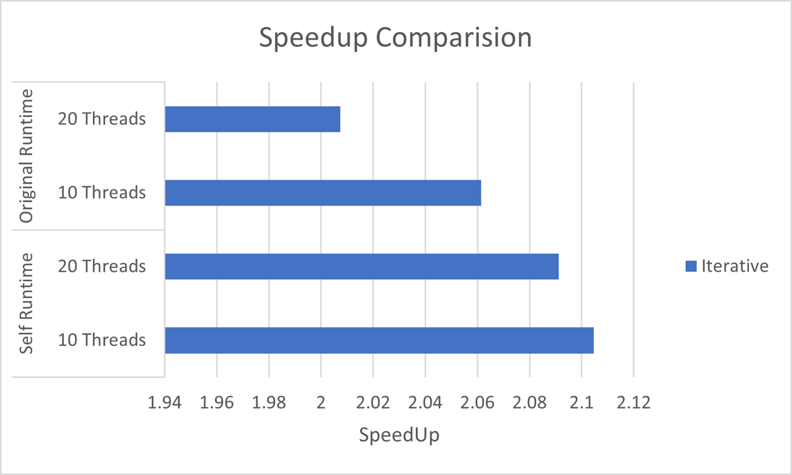

## Runtime Performance Statistics


This repository showcases the performance statistics of a custom runtime developed for a course. The runtime aims to improve the execution speed of specific tasks compared to a baseline system. Here's a breakdown of the performance analysis in four parts:

### Deadline -3
**Part 1: Aim**

* **Goal:** In this deadline, you have to further optimize your parallel runtime by improving its support for locality over modern multicore processors.


**Part 2: Results**

* **Speedup Graphs:** 
    
* **Textual Statistics:** 

| Iterative | Self Runtime | Original Runtime |
|-----------|--------------|------------------|
| Threads   | (seconds)    | (seconds)        |
| 10        | 2.10466      | 2.061493         |
| 20        | 2.091215     | 2.00746          |

**Part 3: Additional Information**

*  **HCLib Runtime Usage**

1. Clone the repository:
    ```bash
    git clone <repository_url>
    ```

2. Navigate to the cloned directory:
    ```bash
    cd <repository_name>
    ```

3. Run the installation script to compile and install the HCLIB runtime:
    ```bash
    ./install.sh
    ```

4. Set the number of workers (optional):
    ```bash
    export HCLIB_WORKERS=<number_of_workers>
    ```

5. Compile and run your application:
    ```bash
    ./<your_application>
    ```


