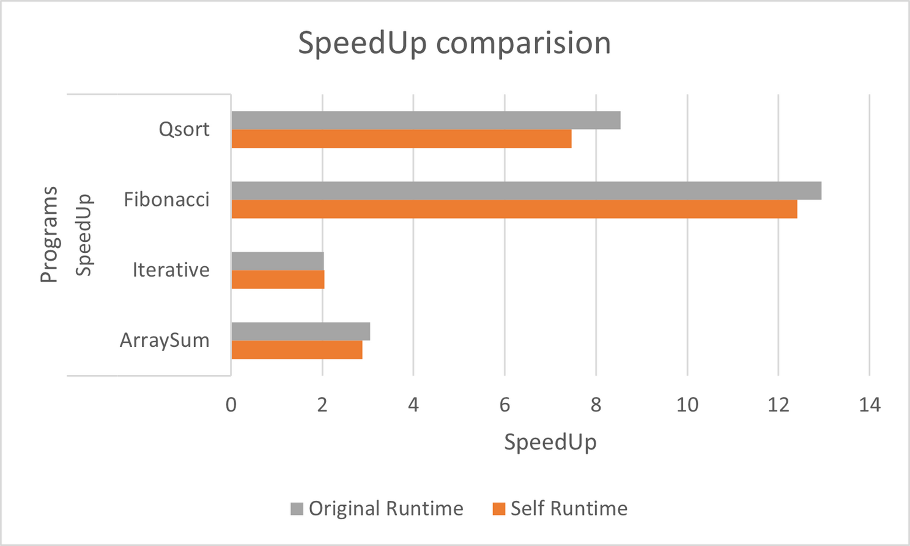
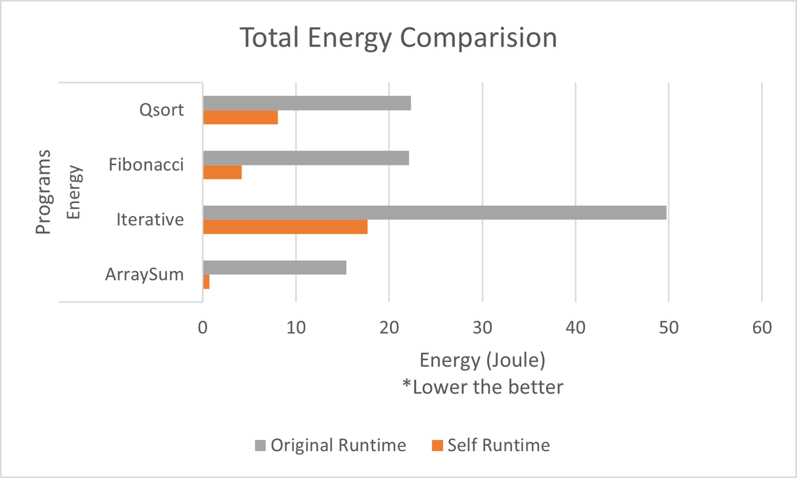

## Runtime Performance Statistics


This repository showcases the performance statistics of a custom runtime developed for a course. The runtime aims to improve the execution speed of specific tasks compared to a baseline system. Here's a breakdown of the performance analysis in four parts:

### Deadline -4
**Part 1: Aim**

* **Goal:** This deadline is devoted to achieving energy efficiency in parallel execution over a multicore processors using a runtime-based approach. You can achieve energy efficiency either by using dynamic concurrency throttling over the multicore processors, or by using power-saving knobs such as DVFS, UFS, and power capping. In this project deadline you would have to use hardware performance counters.
* Analysis was done using likwid library.

**Part 2: Results**

* **Speedup Graphs:** 
    
    

* **Textual Statistics:** 

# Performance Analysis Data Table

|                   | Energy                                                           | netJPI                                                        | SpeedUp                                                   |
|-------------------|------------------------------------------------------------------|---------------------------------------------------------------|-----------------------------------------------------------|
|                   | ArraySum        | Iterative      | Fibonacci     | Qsort         | ArraySum      | Iterative     | Fibonacci     | Qsort         | ArraySum     | Iterative    | Fibonacci    | Qsort        |
| Self Runtime      | 0.727026367     | 17.67781982    | 4.181396484   | 8.071838379   | 1.36715E-10   | 3.46166E-09   | 3.56012E-10   | 1.2652E-09    | 2.872729473  | 2.045752426  | 12.41238356  | 7.466778699  |
| Original Runtime  | 15.39738        | 49.731125      | 22.12824      | 22.351275     | 4.82E-09      | 9.175E-09     | 1.02E-09      | 2.85E-09      | 3.052568991  | 2.029028894  | 12.94633874  | 8.538735159  |


**Part 3: Additional Information**

*  **HCLib Runtime Usage**

1. Clone the repository:
    ```bash
    git clone <repository_url>
    ```

2. Navigate to the cloned directory:
    ```bash
    cd <repository_name>
    ```

3. Run the installation script to compile and install the HCLIB runtime:
    ```bash
     HCLIB_FLAGS=--enable-perfcounter ./install.sh”
    ```

4. Enable perfcounters for the CPU
   ```bash
      sudo modprob msr
      sudo chmod +rw /dev/cpu/*/msr
   ```

5. Set the number of workers (optional):
    ```bash
    export HCLIB_WORKERS=<number_of_workers>
    ```

6. Compile and run your application:
    ```bash
    ./<your_application>
    ```


